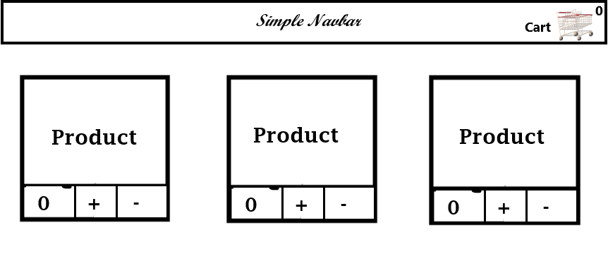
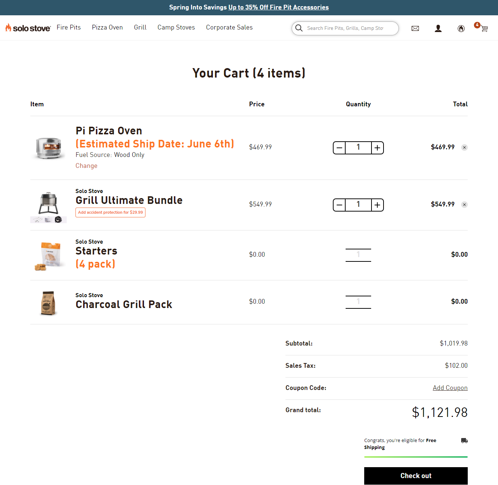

Get all the data from given below URL and display the list of products in the shopping app

 URL : https://dummyjson.com/products

the updating part like adding the item to the cart and list of the product selected that particular work needs to be done in redux 

must need components 
1 - navbar 
2 - cart 
3 - Main page 

On the Main page, you have to make a list of products with the functionality that the user can add the item to the card 

For Example :

On the cart, you have to show the list of products the user added to the cart 

For Example :
